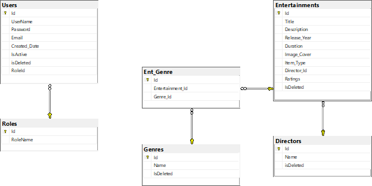
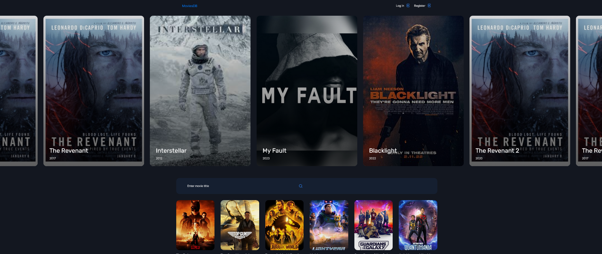
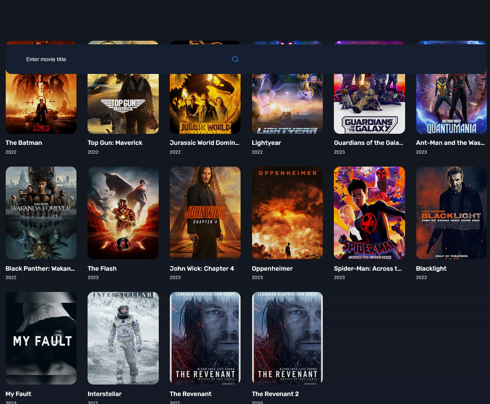
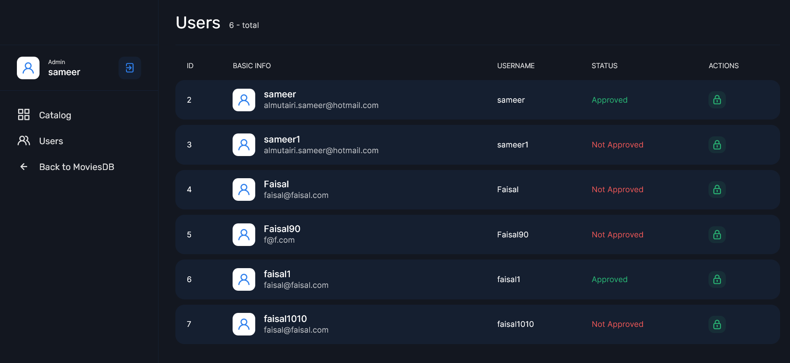

# MoviesDB

This is a sample ASP.net MVC project that demonstrates how to create a movie database. The project uses Entity Framework to interact with a SQL Server database.

## Getting Started

To get started with the project, follow these steps:

1. Clone the repository using Git or download the ZIP file.
2. Open the solution in Visual Studio.
3. Build the solution to restore NuGet packages and compile the code.

## Database
The project uses Entity Framework to interact with a SQL Server database.




## Features

The MoviesDB project includes the following features:

- A home page that displays a list of all movies in the database.
- A details page that displays information about a specific movie.
- A create page that allows the admin to add new movies to the database.
- Search functionality that allows users to search for movies by title or genre.
- Permission functionality that allows the admin to accept new users.


## Screenshots
Here are some screenshots of the Movies database application:

- A home page showing a list of movies:



- Search page allowing users to search for movies by title:



- List of users:




## Technologies Used

The MoviesDB project uses the following technologies:

- ASP.net MVC: The web application framework used to build the project.
- Entity Framework: The object-relational mapping (ORM) framework used to interact with the database.
- SQL Server: The relational database management system (RDBMS) used to store movie data.

The project also uses the following libraries and tools:

- Bootstrap: The front-end framework used to style the user interface.
- jQuery: The JavaScript library used to handle client-side interactions.
- Visual Studio: The integrated development environment (IDE) used to develop and debug the project.
```
